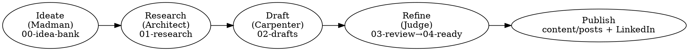

# Writing Engine

## Overview

A personal-brand writing engine that takes an idea from spark to published post using
the **Flowers Paradigm** — four roles, each with hard boundaries: **Madman** (generate),
**Architect** (structure), **Carpenter** (build), **Judge** (polish). The discipline is
the point: each role does one job and refuses the others. The Madman never judges; the
Carpenter never edits.

**The pipeline is folder-based.** Each idea is one Markdown note in `pipeline/` that moves
through numbered stage folders. The final published post is a real Hugo post in
`content/posts/` plus a LinkedIn-formatted version.

**This is a flexible skill** — adapt the prose, lenses, and research depth to the topic.
But the phase boundaries and the **Source Grounding Policy** are rigid: do not blur roles,
do not ship ungrounded facts.

## Storage & Mechanics (this repo)

- **Pipeline notes**: `pipeline/{00-idea-bank,01-research,02-drafts,03-review,04-ready}/`.
  Notes are Markdown with **YAML** front matter; the `status:` field tracks position.
- **Promote a note** = move the file to the next folder (`git mv` or Write new + delete old)
  AND update `status:` in its front matter. One note, moving forward.
- **Published Hugo post**: `content/posts/<slug>.md` — **TOML** front matter (`+++`),
  `draft = false`. See "Publish" for the exact template. Images go in
  `static/images/<slug>/`.
- **Tools**: use `Read`/`Write`/`Edit`/`Glob` for files; `WebSearch`/`WebFetch` for signals
  and research (load via ToolSearch if not already available). There is NO vault MCP here —
  use plain repo files.
- Today's date is available in context; use it for `created:`/`date:` and `accessed` stamps.

## Source Grounding Policy (non-negotiable)

**Every factual claim, data point, or technical detail in a post MUST trace to a verified
external source.** Opinions and personal experience are fine when *labeled as such*; facts
require a link.

1. **No ungrounded assertions** — if you can't cite it, don't write it.
2. **Collect sources as you go** — every research step appends to a `## Sources` block.
3. **Source format** in notes:
   ```markdown
   ## Sources
   - [S1] [Title](url) — what this proves/supports (accessed YYYY-MM-DD)
   ```
4. **In-text refs** — during drafting use inline `[S1]`, `[S2]`. The Judge converts these
   to real hyperlinks.
5. **Quality tiers**: ✅ Tier 1 (AWS/vendor official docs, blogs, talks, peer-reviewed,
   announcements) · ✅ Tier 2 (reputable tech press, published benchmarks/case studies) ·
   ⚠️ Tier 3 (community posts, SO, personal blogs — label as "community perspective") ·
   ❌ Never (unverifiable claims, "studies show" with no link, invented stats).
6. **Freshness** — any source >12 months old must be re-verified for currency (cloud moves fast).
7. **Minimum sources**: 3 for a short post, 5+ for long-form.

## Content Strategy

**Expertise areas** (priority): GenAI / Amazon Bedrock → ML / SageMaker → IoT → Automotive.
**Voice**: adaptive — technical/practical for deep dives (code welcome), strategic/provocative
for trends. **Frequency**: ~1 post/week. **Platforms**: Hugo blog (this repo) and LinkedIn,
treated as equal targets; Medium optional.

## Workflow



**Never skip a phase.** Each role's boundary is what makes the next role's job possible.
If a phase isn't named by the user, scan `pipeline/` to report status (ideas in bank,
work in progress, ready to publish) and ask which phase to enter.

---

### Phase 1 — Ideate (Madman) 🌀

**Goal**: 3–5 new idea notes in `00-idea-bank/`. Generate abundantly; **judge nothing here.**

**A) Signal collection** (if no topic given): `WebSearch` for trending topics across the
expertise areas; cross-reference what practitioners are asking against recent announcements.
What's new that makes a topic relevant *now*?

**B) Topic expansion** (always): for each seed, generate **5 angle variations**:

| Lens | Example |
|------|---------|
| Tutorial | "How I built X with Y — step by step" |
| Hot Take | "Unpopular opinion: X is overhyped because…" |
| Comparison | "X vs Y: when to use which (decision tree)" |
| Case Study | "How [pattern] solved X using Y" |
| Counterintuitive | "Everyone thinks X, but actually Y because…" |

Present variations to Fabio. He picks 1–3 to keep.

**C) Create a note** per approved idea at `pipeline/00-idea-bank/YYYY-MM-DD-slug.md`:
```markdown
---
title: "Post Title Hook"
status: idea
expertise: GenAI | ML | IoT | Automotive
signal: "What triggered this"
angle: tutorial | hot-take | comparison | case-study | counterintuitive
created: YYYY-MM-DD
tags: [content-pipeline]
---
# Post Title Hook
## Signal Source
## Uniqueness Angle      <!-- what makes Fabio's take different -->
## Audience Value        <!-- what the reader gains / can apply -->
## Key Points (rough)
- …
## Sources
- [S1] [Signal title](url) — the trigger (accessed YYYY-MM-DD)
## Research Pointers
- …
```

**Madman rules**: quantity over quality · cross-pollinate domains · ask "what if?" · no
perfectionism · **NEVER judge during ideation — that's the Judge's job later.**

---

### Phase 2 — Research & Outline (Architect) 📐

**Goal**: a structured outline in `01-research/` backed by ≥3 verified sources.

**A) Promote**: move the chosen note `00-idea-bank/` → `01-research/`, set `status: research`.

**B) Research across 4 dimensions** (cap ~20 min/dimension): **Accuracy** (official docs —
correct, current capabilities), **Differentiation** (what's already been said — find the gap),
**Evidence** (case studies, benchmarks, metrics), **Timeliness** (recent announcements — why now).
Log every source into `## Sources` immediately. **Do not outline with <3 quality sources** —
if research is thin, flag it; the angle may need to change.

**C) Build the outline** (append to the note): Hook (write 3 options) · Thesis (one sentence) ·
3–5 Sections, each with key point + `[S#]` evidence + transition · CTA · Platform notes.

**D) Evidence Relationship Map (mandatory)** — annotate the logical link between adjacent
evidence items so the Carpenter knows what bridge to write:
```markdown
## Evidence Relationships
- [S1 → S2]: CAUSAL — "S1 happened because of the problem S2 quantifies"
- [S2 → S3]: SUPPORTS — "S3 is an analyst explaining why S2 matters"
```
Types: CAUSAL ("because", "this is why") · SUPPORTS ("the data confirms") · CONTRASTS
("but", "however") · EXAMPLE ("for example", "in practice") · SEQUENCE ("then", "next").
If you can't name the relationship between two adjacent items, plan a bridge sentence,
split them into separate paragraphs, or cut one.

**Architect rules**: **triage the Madman's output ruthlessly** — a strong post is 3–5 sharp
points, not 10 diluted ones; cut here so the Carpenter builds lean. Structure first, prose
later. Every section must answer "what does this PROVE or TEACH?" The outline is a contract.
Present it to Fabio before drafting.

---

### Phase 3 — Draft (Carpenter) 🪚

**Goal**: a full draft in `02-drafts/` that follows the outline contract.

**A) Promote**: `01-research/` → `02-drafts/`, set `status: draft`. Append a `## Draft` section.

**B) Write** section by section against the outline. Length: ~800–1300 words for a LinkedIn-
first piece, ~1500–2500 for a long-form blog piece. Adapt voice to the `angle:` (Tutorial =
Problem→Steps→Result; Hot Take = Wisdom→Challenge→Evidence→Reframe; Comparison = Criteria→A→B→
Decision; Case Study = Context→Challenge→Solution→Results; Counterintuitive = Expectation→
Discovery→Explanation→Implication).

**C) Hook**: the first 2–3 lines must create curiosity or tension — never a generic opener
("AI is changing everything…"). Write 3 options, let Fabio pick.

**D) CTA**: end with one of — a question inviting comments · a concrete action · a series teaser
· a contrarian reframe.

**Carpenter rules**:
- **Every fact references an `[S#]`.** If you write a claim with no source, either find &
  append the source, rewrite it as labeled opinion ("In my experience…"), or cut it.
- **Bridge Check**: when two consecutive sentences carry different *types* of evidence
  (supply vs demand, quantitative vs qualitative, actor A vs B), insert an explicit bridge
  stating the relationship (consult the Evidence Relationship map). If you can't state the
  bridge in ≤10 words, the items belong in separate paragraphs.
- **DO NOT EDIT while writing** — leave `[JUDGE: tighten]` / `[JUDGE: fact-check]` notes and
  keep momentum. Write the ugly version first. If a section is hard, drop `[TODO]` and move on.
- Follow the outline — don't restructure mid-draft.

---

### Phase 4 — Refine & Edit (Judge) ⚖️

**Goal**: a polished post in `04-ready/` that passes every quality check.

**A) Promote**: `02-drafts/` → `03-review/`, set `status: review`.

**B) Three passes** (then stop — three max):
1. **Structure & source integrity**: does the thesis hold throughout? Does each section earn
   its place? Audit every `[S#]` — source present in `## Sources`, link valid, claim matches
   what the source says. Find orphan claims (facts with no `[S#]`) → cite or rewrite as opinion.
   Flag any source >12 months old.
2. **Clarity**: cut ~20% of words. Kill filler, passive voice, qualifiers ("very", "really").
   Make vague→specific, abstract→concrete. Every paragraph must survive "so what?"
3. **Platform fit**: blog (Hugo) → full markdown, section headers, code blocks OK;
   LinkedIn → paragraphs ≤3 sentences, whitespace, CAPS/emoji instead of `#` headers,
   3–5 hashtags, hook above the fold (~300 chars). Convert `[S#]` markers to real links.

**C) LLM-smell detector** — find and cut/rewrite these AI tells:
- "From X to Y" dichotomies that just restate the evidence ("from reactive to proactive")
- "It's not just X — it's Y" constructions that add no information
- Tricolons for rhythm not content ("faster, smarter, cheaper")
- "paradigm shift / game-changer" with no evidence of the magnitude
- "In today's rapidly evolving landscape…" or any throat-clearing opener
- Sentences that summarize what you just said instead of advancing the argument

  **Test**: cover the suspect sentence. Does the paragraph lose anything? If not — cut it.

**D) Quality scorecard** — score 1–5; **all seven must be ≥4 to pass**:

| Dimension | /5 |
|-----------|----|
| Hook (would you stop scrolling?) | |
| Thesis clarity (one-sentence test) | |
| Evidence quality (specific > vague) | |
| Voice authenticity (not generic AI) | |
| Actionable value | |
| Platform fit | |
| Source grounding (all facts cited, links valid) | |

Present the scorecard with targeted fixes for anything <4. **Get Fabio's approval** before
promoting `03-review/` → `04-ready/` (`status: ready`). This approval is the final quality gate.

**Judge rules**: cut ruthlessly; shorter is almost always better. One wrong fact destroys
credibility — verify every claim. The goal is "great and published," not "perfect and stuck
in drafts."

---

### Phase 5 — Publish 🚀

**Goal**: a real Hugo post **and** a LinkedIn-formatted version. Both targets are equal.

**A) Hugo post** → `content/posts/<slug>.md`. Match this repo's exact convention — **TOML**
front matter, leading space after `+++`, H1 title in the body, inline markdown source links:
```toml
+++ 
draft = false
date = 2026-06-25T09:00:00+01:00
title = "Post Title"
slug = "" 
tags = ["tag1", "tag2", "AWS"]
categories = ["Category"]
+++

# Full Post Title

[body in markdown, with sources as inline [text](url) links]
```
Convert every `[S#]` to an inline hyperlink. Date is RFC3339 with timezone offset. Leave
`slug = ""` unless the user wants a custom one (Hugo derives it from the filename; note
`uglyURLs = true` → the post renders to `/posts/<slug>.html`). Put any images in
`static/images/<slug>/` and reference them as `/images/<slug>/<file>`.

**B) LinkedIn version** — output as plain text Fabio can paste:
```
[HOOK — first 2-3 lines, no markdown]

[Body — short paragraphs, generous line breaks, sparing emoji bullets]

[CTA — question or action]

#hashtag1 #hashtag2 #hashtag3
```

**C) Publishing checklist** (present to Fabio): final proofread ✓ · Hugo post builds
(`hugo server -D` or `hugo --gc --minify`) ✓ · hashtags chosen (≤5) ✓ · best LinkedIn time
(Tue–Thu 8–10am) ✓ · first comment prepared ✓ · featured image decided ✓. **Do not `git
commit`/push unless Fabio asks** — the GitHub Actions workflow deploys on push to `master`.

**D) Archive**: move the pipeline note `04-ready/` → `05-published/` (create the folder if
needed), set `status: published`, `published: YYYY-MM-DD`, and record the live URL when known.

---

## When to Ask Fabio

- Which idea to advance from the bank (always — it's his brand)
- Which of the 3 hook options to use
- Voice/tone for borderline topics (technical vs strategic)
- Approval before `review → ready` (final quality gate)
- Before any `git commit`/push (publishing is outward-facing)

## Common Mistakes

| Mistake | Fix |
|---------|-----|
| Judging during Ideate | Madman generates freely; defer all judgment to the Judge |
| Editing during Draft | Carpenter writes ugly-first; leave `[JUDGE:]` notes |
| Outlining with <3 sources | Flag thin research; re-angle or shelve the idea |
| Ungrounded facts in draft | Cite, relabel as opinion, or cut — no exceptions |
| Generic AI voice | Run the LLM-smell detector; add specific data / personal take |
| Wrong front matter on publish | Hugo posts use **TOML** `+++`, not YAML — copy the template above |
| >3 editing passes | Three max, score ≥4 on all → ship it; perfectionism kills cadence |
| Committing without asking | Build locally; never push unless Fabio asks |
